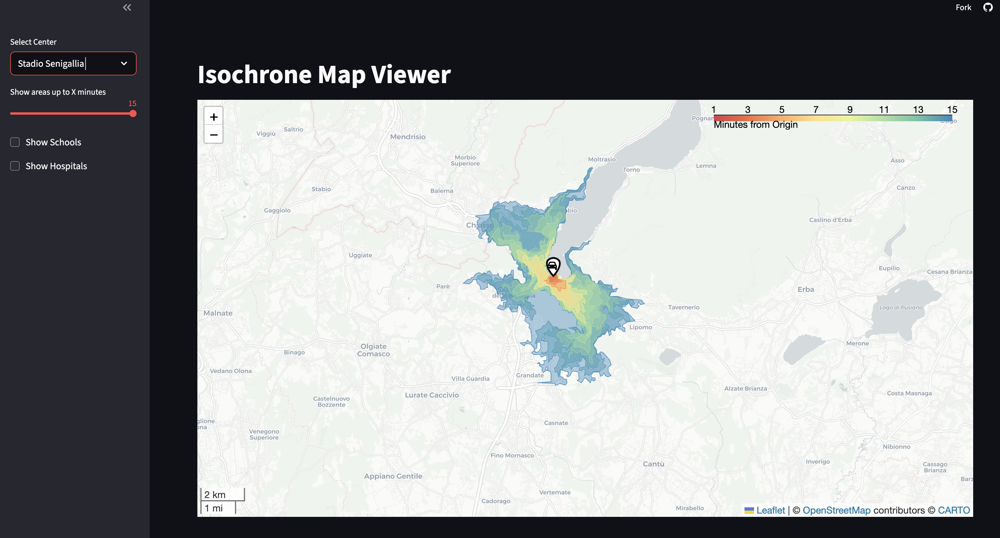

# Urban Accessibility Dashboard (Demo)

This repository contains a **demo web application** for exploring the visualization of **urban accessibility indices**.  
It allows users to compute and display **isochrones** — areas reachable within a given travel time — and overlay contextual geospatial information such as schools or hospitals.

The project evaluates the feasibility of creating an interactive, map-based accessibility-analysis tool.

A live demo (if available) can be found at:  
👉 **[Demo Link](https://freeway.streamlit.app/)**  
*(Provide me the correct link and I will update it.)*

---

## 🗺️ Features

- Interactive **Isochrone Map Viewer**
- Adjustable travel-time threshold (e.g., 1–15 minutes)
- Selectable origin locations (e.g., “Stadio Senigallia”)
- Toggle overlays for:
  - ✅ Schools  
  - ✅ Hospitals
- Uses Leaflet for map rendering
- GeoJSON layers included for several real points of interest

---

## 🖼️ Screenshot



---

## 🚀 Installation

```bash
git clone <your_repo_url>
cd dashboard
python3 -m venv venv
source venv/bin/activate      # Windows: venv\Scripts\activate
pip install -r requirements.txt
```

---

## ▶️ Running the App

```bash
python app.py
```

Then visit:

```
http://127.0.0.1:5000
```

---

## 🔧 Extending the Demo

You can expand this project by adding:

<!-- - Public transport layers (GTFS, NeTEx, routing) -->
- Accessibility metrics (reachability, centrality, travel costs)
- Mode choice (walking, cycling, transit)
- Heatmaps and time-dependent layers  
- Additional POIs (pharmacies, public offices, etc.)

---

## 📄 License

This project is available for **research and educational purposes**.  
Feel free to extend or adapt it.

---

## 👤 Author

**Claudio Tomasi**  
GitHub: https://github.com/claudiotomasi
